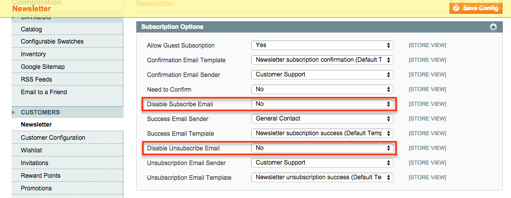
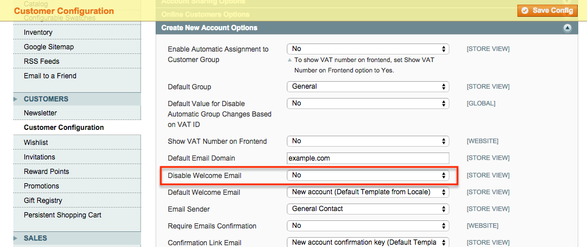

Disable Email Send
==================
Disable sending emails for newsletter subscription and new customer registration.

Description
-----------
Disable sending emails for newsletter subscription and new customer registration.
This module rewrites the Customer model 

How to use
----------

Upload the extension files to your server. In the system configuration for 
Customer -> Newsletter and Customer -> Customer Configuration, 
disable or enable:

